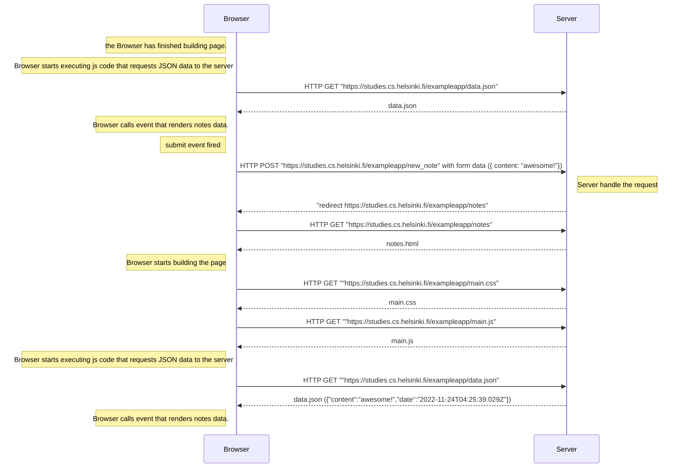

```mermaid
sequenceDiagram
  participant Browser
  participant Server
  Note left of Browser: the Browser has finished building page.
  Note left of Browser: Browser starts executing js code that requests JSON data to the server
  Browser ->> Server: HTTP GET "https://studies.cs.helsinki.fi/exampleapp/data.json"
  Server -->> Browser: data.json
  Note left of Browser: Browser calls event that renders notes data.
  Note left of Browser: submit event fired
  Browser ->> Server: HTTP POST "https://studies.cs.helsinki.fi/exampleapp/new_note" with form data ({ content: "awesome!"})
  Note right of Server: Server handle the request
  Server -->> Browser: "redirect https://studies.cs.helsinki.fi/exampleapp/notes"
  Browser ->> Server: HTTP GET "https://studies.cs.helsinki.fi/exampleapp/notes"
  Server -->> Browser: notes.html
  Note left of Browser: Browser starts building the page
  Browser ->> Server: HTTP GET ""https://studies.cs.helsinki.fi/exampleapp/main.css"
  Server -->> Browser: main.css
  Browser ->> Server: HTTP GET ""https://studies.cs.helsinki.fi/exampleapp/main.js"
  Server -->> Browser: main.js
  Note left of Browser: Browser starts executing js code that requests JSON data to the server
  Browser ->> Server: HTTP GET ""https://studies.cs.helsinki.fi/exampleapp/data.json"
  Server -->> Browser: data.json ({"content":"awesome!","date":"2022-11-24T04:25:39.029Z"})
  Note left of Browser: Browser calls event that renders notes data.
```
