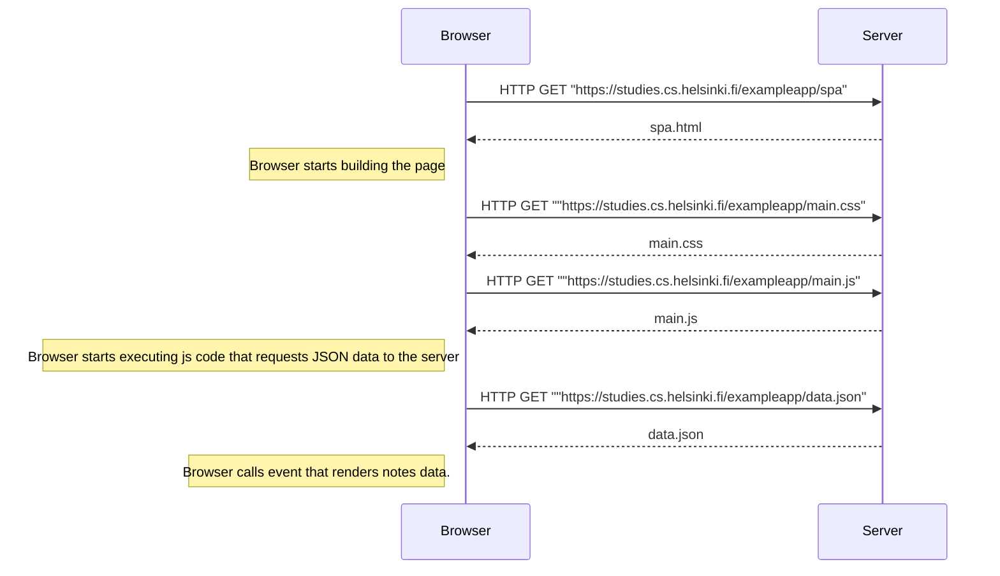

```mermaid
sequenceDiagram
participant Browser
participant Server
Browser ->> Server: HTTP GET "https://studies.cs.helsinki.fi/exampleapp/spa"
Server -->> Browser: spa.html
Note left of Browser: Browser starts building the page
Browser ->> Server: HTTP GET ""https://studies.cs.helsinki.fi/exampleapp/main.css"
Server -->> Browser: main.css
Browser ->> Server: HTTP GET ""https://studies.cs.helsinki.fi/exampleapp/main.js"
Server -->> Browser: main.js
Note left of Browser: Browser starts executing js code that requests JSON data to the server
Browser ->> Server: HTTP GET ""https://studies.cs.helsinki.fi/exampleapp/data.json"
Server -->> Browser: data.json
Note left of Browser: Browser calls event that renders notes data.
```
