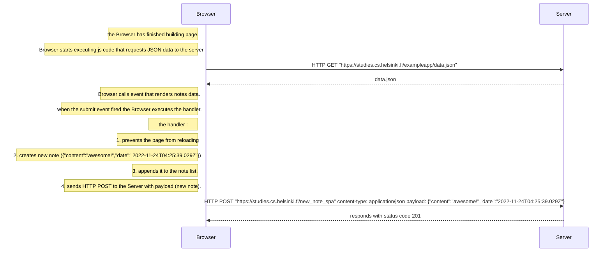

```mermaid
sequenceDiagram
participant Browser
participant Server
Note left of Browser: the Browser has finished building page.
Note left of Browser: Browser starts executing js code that requests JSON data to the server
Browser ->> Server: HTTP GET "https://studies.cs.helsinki.fi/exampleapp/data.json"
Server -->> Browser: data.json
Note left of Browser: Browser calls event that renders notes data.
Note left of Browser: when the submit event fired the Browser executes the handler.
Note left of Browser: the handler :
Note left of Browser: 1. prevents the page from reloading
Note left of Browser: 2. creates new note ({"content":"awesome!","date":"2022-11-24T04:25:39.029Z"})
Note left of Browser: 3. appends it to the note list.
Note left of Browser: 4. sends HTTP POST to the Server with payload (new note).
Browser ->> Server: HTTP POST "https://studies.cs.helsinki.fi/new_note_spa" content-type: application/json payload: {"content":"awesome!","date":"2022-11-24T04:25:39.029Z"}
Server -->> Browser: responds with status code 201
```
